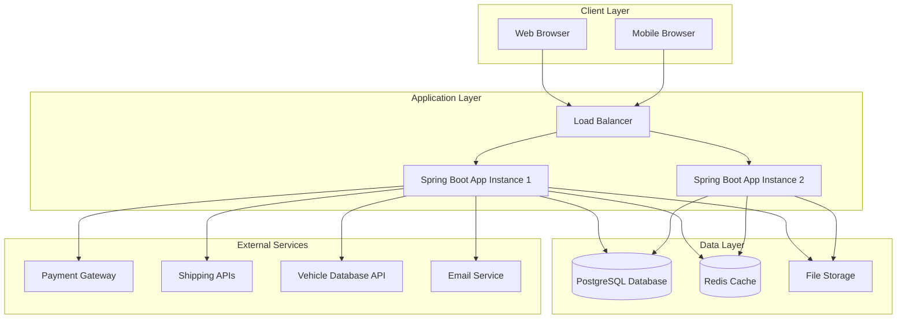
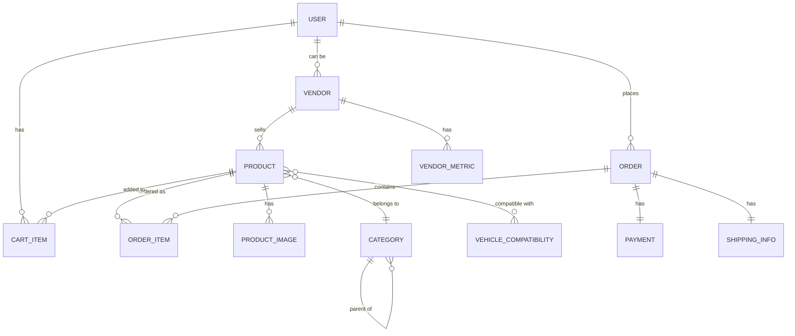

# Design Document - Car Parts Marketplace

## Overview

The Car Parts Marketplace is a multi-vendor e-commerce platform built using Spring Boot for the backend, Thymeleaf for server-side rendering, and PostgreSQL for data persistence. The system follows a layered architecture pattern with clear separation of concerns, implementing REST APIs for internal communication and external integrations.

The application will be developed in three phases:
- **Phase 1**: Single-vendor product catalog with customer purchasing
- **Phase 2**: Basic seller management and inventory tools  
- **Phase 3**: Full multi-vendor marketplace with advanced analytics

## Architecture

### High-Level Architecture



### Technology Stack

- **Backend Framework**: Spring Boot 3.x with Java 17
- **Web Layer**: Thymeleaf for server-side rendering
- **Database**: PostgreSQL 15+ for primary data storage
- **Caching**: Redis for session management and frequently accessed data
- **Build Tool**: Gradle for dependency management and builds
- **Security**: Spring Security for authentication and authorization
- **File Storage**: Local filesystem for development, cloud storage for production
- **External Integrations**: REST clients for payment, shipping, and vehicle APIs

## Components and Interfaces

### Core Components

#### 1. Web Controllers Layer
- **ProductController**: Handles product catalog, search, and detail pages
- **CartController**: Manages shopping cart operations
- **CheckoutController**: Processes order placement and payment
- **VendorController**: Vendor dashboard and management functions
- **AdminController**: Administrative functions and system management
- **ApiController**: REST endpoints for AJAX operations

#### 2. Service Layer
- **ProductService**: Business logic for product management and search
- **CartService**: Shopping cart operations and session management
- **OrderService**: Order processing, payment coordination, and fulfillment
- **VendorService**: Vendor registration, verification, and management
- **UserService**: User authentication, registration, and profile management
- **NotificationService**: Email and SMS notification handling
- **SearchService**: Advanced search functionality with filtering
- **InventoryService**: Stock management and availability tracking

#### 3. Repository Layer
- **ProductRepository**: Product data access with custom queries
- **OrderRepository**: Order and order item persistence
- **VendorRepository**: Vendor information and metrics storage
- **UserRepository**: User account and authentication data
- **CartRepository**: Shopping cart persistence
- **CategoryRepository**: Product categorization data

#### 4. Integration Layer
- **PaymentGatewayClient**: Stripe/PayPal integration for payment processing
- **ShippingClient**: UPS/FedEx/USPS API integration for shipping calculations
- **VehicleApiClient**: External vehicle database for license plate lookup
- **EmailClient**: Email service provider integration
- **FileStorageClient**: Image and document storage management

### Interface Definitions

#### REST API Endpoints

```java
// Product APIs
GET /api/products - List products with pagination and filters
GET /api/products/{id} - Get product details
GET /api/products/search - Search products with criteria
GET /api/categories - List product categories

// Cart APIs  
POST /api/cart/add - Add item to cart
PUT /api/cart/update - Update cart item quantity
DELETE /api/cart/remove/{itemId} - Remove item from cart
GET /api/cart - Get current cart contents

// Order APIs
POST /api/orders - Create new order
GET /api/orders/{id} - Get order details
PUT /api/orders/{id}/status - Update order status

// Vendor APIs
POST /api/vendors/register - Vendor registration
GET /api/vendors/{id}/dashboard - Vendor dashboard data
POST /api/vendors/{id}/products - Add vendor product
PUT /api/vendors/{id}/products/{productId} - Update vendor product
```

## Data Models

### Core Entity Relationships



### Entity Specifications

#### User Entity
```java
@Entity
public class User {
    @Id
    private Long id;
    private String email;
    private String passwordHash;
    private String firstName;
    private String lastName;
    private String phone;
    private UserRole role; // CUSTOMER, VENDOR, ADMIN
    private LocalDateTime createdAt;
    private boolean emailVerified;
    private boolean active;
    
    @OneToMany(mappedBy = "user")
    private List<Address> addresses;
    
    @OneToOne(mappedBy = "user")
    private Vendor vendor;
}
```

#### Product Entity
```java
@Entity
public class Product {
    @Id
    private Long id;
    private String name;
    private String description;
    private BigDecimal price;
    private String partNumber;
    private String oemNumber;
    private ProductCondition condition;
    private int stockQuantity;
    private boolean active;
    private LocalDateTime createdAt;
    
    @ManyToOne
    private Vendor vendor;
    
    @ManyToOne
    private Category category;
    
    @OneToMany(mappedBy = "product")
    private List<ProductImage> images;
    
    @OneToMany(mappedBy = "product")
    private List<VehicleCompatibility> compatibilities;
}
```

#### Order Entity
```java
@Entity
public class Order {
    @Id
    private Long id;
    private String orderNumber;
    private OrderStatus status;
    private BigDecimal subtotal;
    private BigDecimal taxAmount;
    private BigDecimal shippingAmount;
    private BigDecimal totalAmount;
    private LocalDateTime createdAt;
    
    @ManyToOne
    private User customer;
    
    @OneToMany(mappedBy = "order")
    private List<OrderItem> items;
    
    @OneToOne
    private Payment payment;
    
    @OneToOne
    private ShippingInfo shippingInfo;
}
```

#### Vendor Entity
```java
@Entity
public class Vendor {
    @Id
    private Long id;
    private String businessName;
    private String taxId;
    private String description;
    private VendorStatus status; // PENDING, APPROVED, SUSPENDED
    private BigDecimal commissionRate;
    private LocalDateTime createdAt;
    
    @OneToOne
    private User user;
    
    @OneToMany(mappedBy = "vendor")
    private List<Product> products;
    
    @OneToMany(mappedBy = "vendor")
    private List<VendorMetric> metrics;
}
```

### Database Schema Considerations

- **Indexing Strategy**: Composite indexes on frequently queried columns (product search, vendor filtering)
- **Partitioning**: Order tables partitioned by date for performance
- **Constraints**: Foreign key constraints for data integrity, check constraints for business rules
- **Audit Trail**: Created/modified timestamps on all entities, soft deletes where appropriate
- **Performance**: Materialized views for complex vendor analytics and reporting

## Error Handling

### Exception Hierarchy

```java
// Base application exception
public abstract class MarketplaceException extends RuntimeException

// Specific business exceptions
public class ProductNotFoundException extends MarketplaceException
public class InsufficientStockException extends MarketplaceException  
public class PaymentProcessingException extends MarketplaceException
public class VendorNotVerifiedException extends MarketplaceException
public class InvalidSearchCriteriaException extends MarketplaceException
```

### Error Response Strategy

- **User-Facing Errors**: Friendly error messages displayed via Thymeleaf templates
- **API Errors**: Structured JSON responses with error codes and messages
- **Logging**: Comprehensive logging with correlation IDs for request tracing
- **Monitoring**: Integration with application monitoring for error alerting

### Validation Strategy

- **Input Validation**: Bean Validation (JSR-303) annotations on DTOs
- **Business Rule Validation**: Custom validators in service layer
- **Database Constraints**: Database-level constraints as final validation layer
- **Client-Side Validation**: JavaScript validation for immediate user feedback

## Testing Strategy

### Testing Pyramid

#### Unit Tests (70%)
- **Service Layer**: Business logic testing with mocked dependencies
- **Repository Layer**: Data access testing with @DataJpaTest
- **Utility Classes**: Pure function testing
- **Validation Logic**: Input validation and business rule testing

#### Integration Tests (20%)
- **Controller Tests**: @WebMvcTest for web layer testing
- **Database Integration**: @SpringBootTest with test containers
- **External Service Integration**: WireMock for API mocking
- **Security Testing**: Authentication and authorization flows

#### End-to-End Tests (10%)
- **User Journey Tests**: Selenium WebDriver for critical user flows
- **API Contract Tests**: Postman/Newman for API endpoint validation
- **Performance Tests**: JMeter for load testing critical paths
- **Cross-Browser Testing**: Key functionality across major browsers

### Test Data Management

- **Test Fixtures**: Reusable test data builders and factories
- **Database Seeding**: Flyway scripts for consistent test data
- **Test Isolation**: Transactional rollback for unit tests
- **Test Containers**: PostgreSQL containers for integration tests

### Continuous Testing

- **Pre-commit Hooks**: Unit tests and code quality checks
- **CI Pipeline**: Full test suite execution on pull requests
- **Deployment Testing**: Smoke tests in staging environment
- **Production Monitoring**: Health checks and synthetic transactions

## Security Considerations

### Authentication and Authorization

- **Spring Security**: Role-based access control (RBAC)
- **Session Management**: Secure session handling with Redis
- **Password Security**: BCrypt hashing with salt
- **Multi-Factor Authentication**: Optional 2FA for vendor accounts

### Data Protection

- **Encryption**: TLS 1.3 for data in transit, AES-256 for sensitive data at rest
- **PCI Compliance**: Tokenization for payment card data
- **GDPR Compliance**: Data anonymization and right to deletion
- **Input Sanitization**: XSS prevention and SQL injection protection

### API Security

- **Rate Limiting**: Request throttling to prevent abuse
- **CORS Configuration**: Restricted cross-origin requests
- **API Authentication**: JWT tokens for API access
- **Request Validation**: Comprehensive input validation and sanitization

## Performance Optimization

### Caching Strategy

- **Application Cache**: Redis for session data and frequently accessed products
- **Database Query Cache**: PostgreSQL query result caching
- **CDN Integration**: Static asset delivery via content delivery network
- **Browser Caching**: Appropriate cache headers for static resources

### Database Optimization

- **Query Optimization**: Efficient queries with proper indexing
- **Connection Pooling**: HikariCP for database connection management
- **Read Replicas**: Separate read/write database instances for scaling
- **Pagination**: Efficient pagination for large result sets

### Application Performance

- **Lazy Loading**: JPA lazy loading for related entities
- **Async Processing**: Background jobs for email sending and report generation
- **Image Optimization**: Automatic image compression and resizing
- **Monitoring**: Application performance monitoring with metrics collection

## Deployment Architecture

### Environment Strategy

- **Development**: Local PostgreSQL with Docker, embedded Redis
- **Staging**: Cloud-hosted PostgreSQL (Supabase), Redis cluster
- **Production**: High-availability PostgreSQL, Redis cluster, load balancing

### CI/CD Pipeline

- **Source Control**: Git with feature branch workflow
- **Build Process**: Gradle build with automated testing
- **Deployment**: Docker containers with blue-green deployment
- **Database Migrations**: Flyway for version-controlled schema changes

### Monitoring and Observability

- **Application Metrics**: Micrometer with Prometheus integration
- **Logging**: Structured logging with ELK stack
- **Health Checks**: Spring Boot Actuator endpoints
- **Alerting**: Automated alerts for system health and business metrics