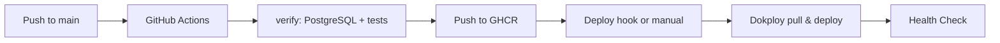

# GitHub Actions & Dokploy Deployment

This directory contains the GitHub Actions workflow that builds the Docker image and pushes it to **GitHub Container Registry (GHCR)** for deployment on Dokploy.

## Files

- **`workflows/deploy.yml`** — On every **pull request** (→ `main` / `develop`) and **push** to `main`: run **Flyway** + **`./gradlew test`** against a **PostgreSQL 15 service container** (no external DB secrets). On **push** to `main` only, also **build and push** the image to `ghcr.io`

### CI database

El job `verify` levanta **Postgres 15 Alpine** en el runner (`recicar_test` / `marketplace_test`). No hace falta configurar secretos `TEST_DATABASE_*` en GitHub.

## What the workflow does

1. **Triggers** on push to `main` / PRs to `main` or `develop`
2. **verify:** Postgres en servicio → `flywayMigrateTest` → `test`
3. **build (solo push a `main`):** **Build** the image using the repo `Dockerfile` → **Push** to GHCR with tags `latest` and `main-<commit-sha>`
4. **Image name:** `ghcr.io/<owner>/<repo>` (GitHub path, lowercased for the registry)

## Requirements

- Repo **Settings → Actions → General → Workflow permissions:** **Read and write permissions** (so `GITHUB_TOKEN` can push packages), or a PAT with `write:packages` wired into the workflow if you customize it
- **No Docker Hub** account or secrets for the default workflow

## Dokploy

### Producción

- **Source type:** Docker  
- **Image:** `ghcr.io/<your-lower-case-owner>/<your-lower-case-repo>:latest`  
- For **private** packages, configure registry login on Dokploy (`ghcr.io` + GitHub username + PAT with `read:packages`)

### Entorno test (PostgreSQL en Dokploy)

Despliega un **servicio PostgreSQL** en el mismo proyecto/red que la app (plantilla de base de datos de Dokploy o stack Docker). Variables de la aplicación (perfil **`test`**):

- `SPRING_PROFILES_ACTIVE=test`
- `DATABASE_URL`, `DATABASE_USERNAME`, `DATABASE_PASSWORD` apuntando al hostname **interno** del Postgres del stack test.

Detalle en **[../DEPLOYMENT.md](../DEPLOYMENT.md)** (sección entorno test).

## Documentation

- **Quick checklist:** [DOKPLOY_SETUP.md](./DOKPLOY_SETUP.md)
- **Full guide:** [../DEPLOYMENT.md](../DEPLOYMENT.md)

## Deployment flow


```mermaid
graph LR
    A[Push to main] --> B[GitHub Actions]
    B --> C[verify: PostgreSQL + tests]
    C --> D[Push to GHCR]
    D --> E[Deploy hook or manual]
    E --> F[Dokploy pull & deploy]
    F --> G[Health Check]
```

## Customization

### Trigger branches

Edit `workflows/deploy.yml`:

```yaml
on:
  push:
    branches: ["main", "production"]
```

### Dokploy webhook after push

Add a step that POSTs to your Dokploy deploy URL (secret). See `DEPLOYMENT.md`.

### Multi-arch

In `deploy.yml`, extend platforms on the build-push step, for example:

```yaml
platforms: linux/amd64,linux/arm64
```

## Monitoring

- **Builds:** GitHub → Actions  
- **Images:** GitHub → Packages (`ghcr.io`)  
- **Runtime:** Dokploy dashboard and logs

## Troubleshooting

- **403 / denied push to ghcr.io:** fix workflow permissions or use a PAT with `write:packages` in `docker/login-action`
- **Dokploy pull fails:** check image name (lowercase), tag `latest`, and private-registry credentials
- **Dockerfile errors:** inspect the failed job log in Actions

## Security

- Do not commit registry or application secrets; use GitHub Secrets and Dokploy environment variables
- Rotate PATs used for private `docker pull` from GHCR

---

**Questions?** See [../DEPLOYMENT.md](../DEPLOYMENT.md)
