# GitHub Actions & Dokploy Deployment

This directory contains the GitHub Actions workflow for automated Docker image building and deployment to Dokploy.

## 📁 Files Created

### Workflow Files
- **`workflows/deploy.yml`** - Main GitHub Actions workflow that builds and pushes Docker images to Docker Hub

### Documentation
- **`DOKPLOY_SETUP.md`** - Quick setup guide with checklists
- **`../DEPLOYMENT.md`** - Comprehensive deployment documentation

### Configuration
- **`../.dockerignore`** - Optimizes Docker builds by excluding unnecessary files

## 🎯 What This Workflow Does

1. **Triggers** on every push to the `main` branch
2. **Builds** the Spring Boot application using the existing Dockerfile
3. **Pushes** the Docker image to Docker Hub with tags:
   - `latest` - Always points to the newest version
   - `main-<commit-sha>` - Version specific to each commit
4. **Enables** Dokploy to pull and deploy the pre-built image

## ✨ Benefits

- **No Server Overload**: Builds happen on GitHub's infrastructure, not your Dokploy server
- **Faster Deployments**: Pre-built images download much faster than building from source
- **Automatic**: Just push code and it deploys automatically
- **Versioned**: Every deployment is tagged with the commit SHA
- **Zero Downtime**: When configured with health checks in Dokploy

## 🚀 Getting Started

1. **Read**: [DOKPLOY_SETUP.md](./DOKPLOY_SETUP.md) for quick setup
2. **Follow**: The checklist to configure Docker Hub and GitHub secrets
3. **Push**: Your code to trigger the first build
4. **Configure**: Dokploy to use your Docker image

## 📖 Documentation

- **Quick Start**: [DOKPLOY_SETUP.md](./DOKPLOY_SETUP.md)
- **Full Guide**: [../DEPLOYMENT.md](../DEPLOYMENT.md)
- **Workflow**: [workflows/deploy.yml](./workflows/deploy.yml)

## 🔄 Deployment Flow

```mermaid
graph LR
    A[Push to main] --> B[GitHub Actions]
    B --> C[Build Docker Image]
    C --> D[Push to Docker Hub]
    D --> E[Dokploy Webhook]
    E --> F[Pull & Deploy]
    F --> G[Health Check]
    G -->|Pass| H[Live ✅]
    G -->|Fail| I[Rollback 🔄]
```



## 🛠️ Customization

### Change Trigger Branch
Edit `workflows/deploy.yml`:
```yaml
on:
  push:
    branches: ["main", "production"]  # Add more branches
```

### Add Build Steps
Add additional steps before the Docker build:
```yaml
- name: Run Tests
  run: ./gradlew test

- name: Run Security Scan
  run: ./gradlew dependencyCheckAnalyze
```

### Multi-Architecture Builds
For ARM64 support, modify `workflows/deploy.yml`:
```yaml
platforms: linux/amd64,linux/arm64
```

## 📊 Monitoring

- **Build Status**: GitHub → Actions tab
- **Image Registry**: Docker Hub → Your repository
- **Deployment**: Dokploy dashboard

## 🐛 Troubleshooting

If builds fail:
1. Check the **Actions** tab for error logs
2. Verify GitHub secrets are set correctly
3. Ensure Dockerfile is valid
4. Check Docker Hub credentials

If deployment fails:
1. Verify image was pushed to Docker Hub
2. Check Dokploy environment variables
3. Review application logs in Dokploy
4. Verify database connectivity

## 🔐 Security

- Never commit Docker Hub credentials
- Use GitHub Secrets for sensitive data
- Rotate access tokens regularly
- Keep dependencies updated

---

**Questions?** Check the [full deployment guide](../DEPLOYMENT.md)

